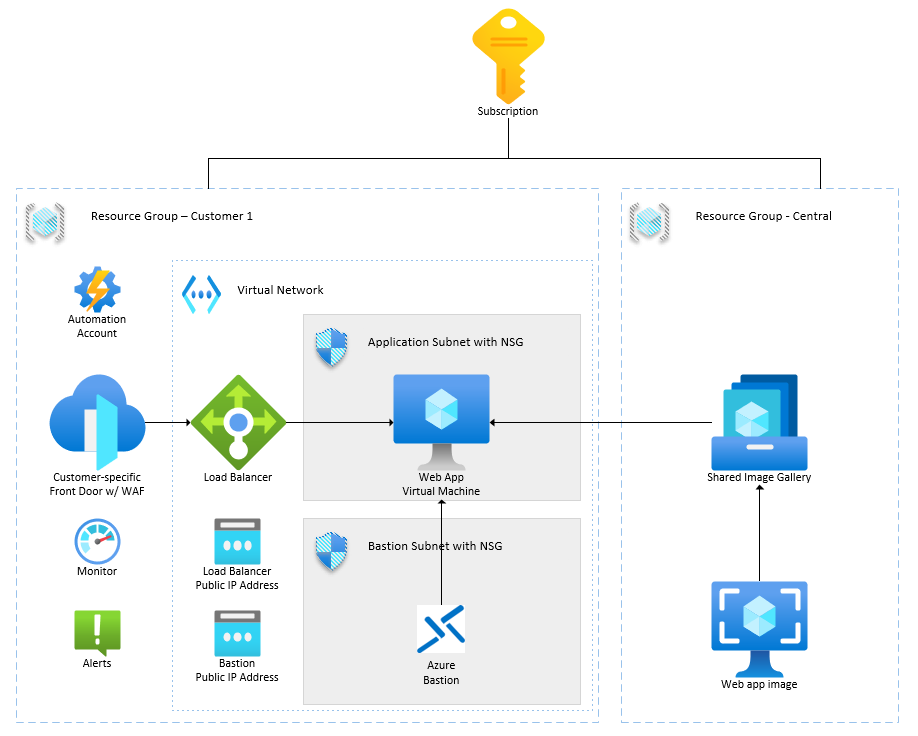

# customerDemoVM

This is a demo of how to use the Azure Image Builder to create a gold image of a VM and deploy it to Azure.

NO WARRANTY is provided for this code. This is demo code provided only as an example.

## Architecture


## Repo structure
The "infra" directory is divided into 3 major sections, each in its own directory.

- pre: The infrastructure that needs to be provisioned before the application VM is deployed. This includes building the gold image via the Azure Image Builder
- image: The scripts to install & configure the VM, called by the Azure Image Builder to make the gold image.
- app: The Bicep (ARM) templates required to deploy the application VM & it's associated infrastructure.

The "ado" directory contains a sample Azure DevOps pipeline to deploy the application VM after creating the gold image.

## Useful scripts

### Deploy the Azure Image Builder

```powershell
$params = @{ 
appName="customerDemoVM"
region="USSC"
environment="central"
longRegion="southcentralus"
}

New-AzResourceGroupDeployment -ResourceGroupName rg-customerDemoVM-USSC-central -TemplateParameterObject $params -TemplateFile ./main.bicep -Verbose
```

### Build the gold image

```
.\ado\buildImage.ps1 -resourceGroupName rg-customerDemoVM-USSC-central -imageTemplateName it-customerDemoVM-USSC-central
```

### Deploy the application VM & associated components

```powershell
$params = @{ 
customerName="DunderMifflin"
region="USSC"
environment="demo"
vmAdminUsername="CHANGEME"
vmAdminPassword="CHANGEME"
vmTimeZone="Central Standard Time"
sharedImageGalleryName="sigcustomerDemoVMUSSCcentral"
demoApplicationImageDefinitionName="img-demoApp"
demoApplicationImageVersion="0.24794.20250"
centralStorageAccountName="sacustomerdemovm"
imageScriptsContainerName="imagescripts"
centralResourceGroupName="rg-customerDemoVM-USSC-central"
}

New-AzResourceGroupDeployment -ResourceGroupName rg-customerDemoVM-DunderMifflin-USSC-demo -TemplateParameterObject $params -TemplateFile ./main.bicep -Verbose
```
